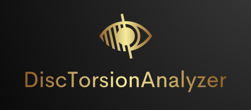
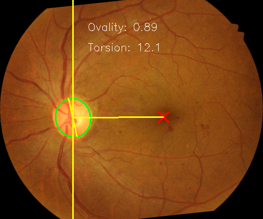

<p align="center">
  <a href="images/LOGO.png">
    
  </a>

  <h3 align="center">DiscTorsionAnalyzer 👁️‍🗨️ </h3>

  <p align="center">
    Software to automatically measure optic disc torsion in colour fundus photographs of the retina
    <br>
</p>


## Table of contents

- [Description](#description)
- [Quick start](#quick-start)
- [Status](#status)
- [Bugs and feature requests](#bugs-and-feature-requests)
- [Contributing](#contributing)
- [Creators](#creators)
- [Copyright and license](#copyright-and-license)

## Description

Optic disc torsion refers to the deviation of the longest axis of the optic disc from its perpendicular meridian. It is a measure of how much the optic disc has rotated from its normal orientation relative to the eye's vertical axis. Measuring optic disc torsion is important because it can provide valuable insights into various ocular and systemic conditions.<br>

This software uses deep learning-based segmentation to estimate en ellipse around the optic and locate the fovea. It then rotates the image along the centrepoints of these two key structures and measures the angle between the vertical line centred on the optic disc and the major axis of the ellipse. The resulting value is either positive (indicating inferotemporal torsion) or negative (indicating supranasal torsion). <br>

Ovality is also measured, defined as the major axis length / minor axis length. A ovality value larger than 1.3 is generally considered **optic disc tilt**. <br>

Manuscript currently in preparation. This measure is currently **NOT CLINICALLY VALIDATED**. For research purpose only. 

## Quick start

### Requirements

1. Linux OS
2. Miniconda
3. GPU

### Installation

Step 1: create virtual environment
```bash
conda update conda
conda create -n DiscTorsionAnalyzer python=3.12 -y
```

Step 2: activate virtual environment and clone repo
```bash
conda activate DiscTorsionAnalyzer
git clone https://github.com/samuel-gibbon/DiscTorsionAnalyzer.git
cd DiscTorsionAnalyzer
```

Step 3: install torch
```bash
pip3 install torch torchvision torchaudio --index-url https://download.pytorch.org/whl/cu118
```
If this step fails, go to https://pytorch.org/get-started/locally/ and follow installation instructions.

Step 4: install other packages
```bash
pip install -r requirements.txt
```
### Running

Open the **config.ini** file and set **pathIn** and **pathOut** <br> 
You can also disable **writeImages** and/or **writeResults** if needed.

```bash
python main.py
```
### Results

One processed image is stored per input image, and numerical results are output in a **results.csv** file. Everything is written to **pathOut**. Example below on an image from the publicly available IDRiD dataset.


| Filename          | Ovality             | Torsion           |
|-------------------|---------------------|-------------------|
| IDRID_28.png      | 0.89                | 12.12             |

## Status

Software is currently working for colour fundus images of any resolution and format (e.g., PNG, JPG).

## Bugs and feature requests

Have a bug or a feature request? Please first read the [issue guidelines](https://github.com/samuel-gibbon/DiscTorsionAnalyzer/blob/main/CONTRIBUTING.md) and search for existing and closed issues. If your problem or idea is not addressed yet, [please open a new issue](https://github.com/samuel-gibbon/DiscTorsionAnalyzer/issues/new).

## Contributing

Please read through our [contributing guidelines](https://github.com/samuel-gibbon/DiscTorsionAnalyzer/blob/main/CONTRIBUTING.md). Included are directions for opening issues, coding standards, and notes on development.

## Creators

**Creator 1**

Created by Samuel Gibbon and Borja Marin

- <https://github.com/samuel-gibbon/DiscTorsionAnalyzer.git>

## Copyright and license

Code and documentation copyright 2023-2024 the authors. Code released under the [MIT License](https://github.com/samuel-gibbon/DiscTorsionAnalyzer/blob/main/LICENSE).
